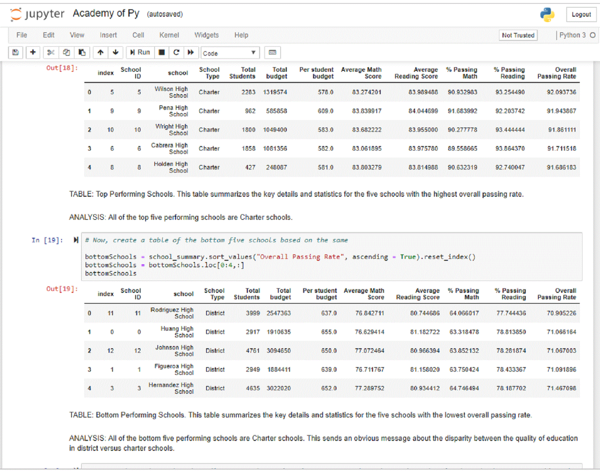

## Academy of Py
Analyze fictitious school district data with the Python Pandas library and Jupyter notebook. Create one high-level snapshot of the district's key metrics, one summary table, and 7 analysis tables.  This work helps gain familiarity with creating tables in Pandas and using Python functions.
