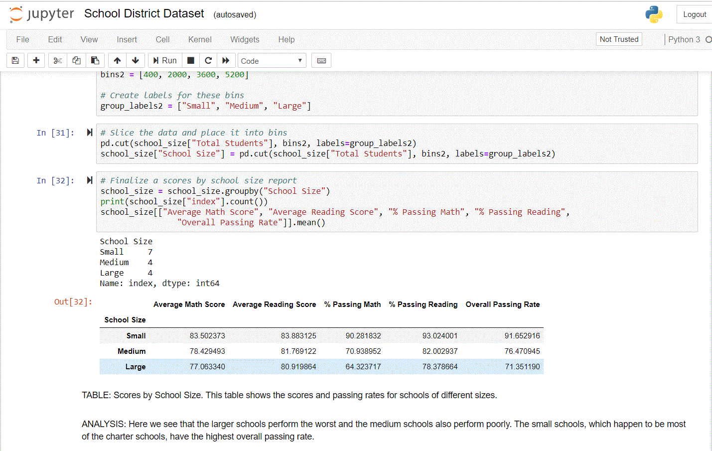

## Academy of Py
Analyze fictitious school district data with the Python Pandas library and Jupyter notebook. Create one high-level snapshot of the district's key metrics, one summary table with all schools, and 7 analysis tables based on specific criteria.  This work helps gain familiarity with manipulating dataframes with Pandas, creating summary tables with Pandas, and using Python functions.
- District Summary
- School Summary
- Top Performing Schools (By Passing Rate)
- Bottom Performing Schools (By Passing Rate)
- Math Scores by Grade
- Reading Schools by Grade
- Scores by School Spending
- Scores by School Size
- Scores by School Type

